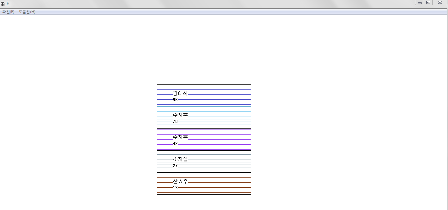
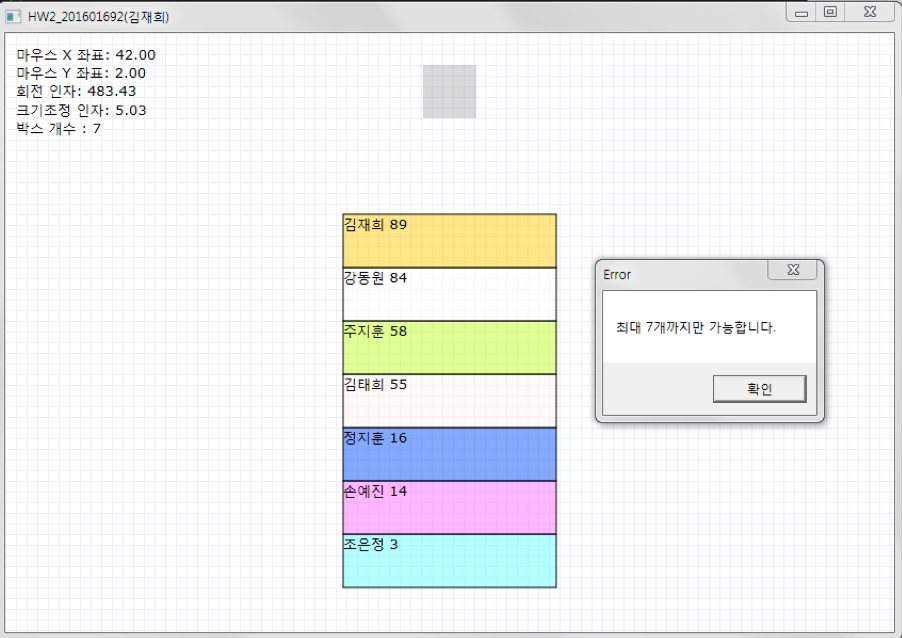

# GameProgramming
2020-1 게임 프로그래밍 (4학년 1학기)

## HW#1

### 구상 내용
* 화면에 네모 상자들을 아래에서 위쪽으로 쌓아서 표시한다.
* 각 상자 안에는 학생 정보 – 성명과 성적을 표시한다.
* 그래픽 처리는 GDI를 이용하고 각 상자의 칼라를 다르게 처리한다.
* 각 상자의 학생 정보는 벡터 컨테이너에 보관한다.
  * 아래의 상자가 벡터의 앞쪽에 하당하고 위의 상자가 벡터의 뒤쪽에 해당한다.
  * 벡터의 변동이 생길 때 마다 벡터의 내용을 화면에 다시 표시한다.
* 더 이상 학생을 추가할 수 없을 경우 메시지창을 표시한다.

### 실행 방법
* 가장 높은 위치의 상자가 클릭되었을 경우 그 상자에 해당하는 학생 정보를 벡터에서 삭제한다.
* 이외의 지점이 클릭되었을 경우 새로운 학생 정보를 벡터에 추가한다.
  * 학생 정보는 최대 7개까지만 허용한다.
  * 성명은 3자리 한글 성명으로 하고, 성적은 1에서 99사이 정수로 한다.
  * 학생 데이터가 벡터에 추가될 때 마다 학생 정보들이 성적에 따른 정렬이 되도록 sort 알고리즘을 적용한다. (아래의 상자가 가장 낮은 성적에 해당하고 위의 상자가 가장 높은 성적에 해당한다.)

## HW#2

### 구상 내용
* 각 상자 안에는 학생 정보 – 성명과 성적을 표시한다.
* 그래픽 처리는 Direct2D를 이용하고 각 상자의 칼라를 다르게 처리한다.
* 각 상자의 학생 정보는 벡터 컨테이너에 보관한다.
  * 아래의 상자가 벡터의 앞쪽에 하당하고 위의 상자가 벡터의 뒤쪽에 해당한다.
  * 벡터의 변동이 생길 때 마다 벡터의 내용을 화면에 다시 표시한다.
* 더 이상 학생을 추가할 수 없을 경우 메시지창을 표시한다. 
* 윈도우 창 상단 중간의 고정된 위치에 희미한 가상의 정사각형 한 개를 표시한다.
  * 항상 표시되고 삽입/삭제를 위한 목적이다.
  * 컬러는 회색이고 한 변의 길이는 하단의 배치될 실제 상자의 높이와 같다.
  * 실제 상자의 너비는 높이의 네 배이다.
* 상자를 추가 및 삭제할 때는 왼쪽 마우스 버튼 드래깅 방식으로 구현한다.

### 실행 방법
* **상자 추가**
  * 왼쪽 마우스 버튼으로 회색 가상의 정사각형의 내부에서 시작하여 드래깅 할 경우
    * 추가될 새 상자와 그 데이터를 생성한 후 드래깅하는 동안 새 상자의 모습을 현재 드래깅 위치에 보여준다. 
* 학생 이름과 성적은 랜덤하게 자동으로 생성된다.
    * 드래깅되는 사각형의 너비는 가상 사각형의 크기에서 시작하여 드래깅하여 놓여질 위치에 가까워질수록 놓여질 실제 너비에 더 가깝게 되도록 한다.
    * 드래깅되는 사각형이 회전되면서 움직인다.
    * 시작위치에서 놓여질 위치까지 360도 시계방향으로 회전한다.
  * 현재 마우스의 위치가 쌓여진 상자들 중에서 다음번 놓일 위치 내부로 들어간 경우 새 상자가 실제로 추가된다.
    * 그 전에 드래깅을 포기하면 새로 만들어진 상자와 해당 데이턴은 무시된다.
    * 새 상자의 추가는 벡터 컨테이너에 추가되고 정렬된다.
    * 새 상자가 추가된 후에는 정렬 결과에 따라서 기존 모든 상자들의 위치가 바뀔 수 있다. 가장 위의 상자는 가장 높은 성적에 해당한다.

* **가장 높은 상자의 삭제**
  * 왼쪽 마우스 버튼으로 쌓여진 상자들 중에서 가장 높은 위치의 상자 내부에서 시작하여 드래깅할 경우
    * 드래깅하는 동안 가장 높은 위치의 상자의 너비가 스케일링 되면서 반시계 방향으로 회전하며 움직인다.
  * 현재 마우스 위치가 상단의 회색 가상 사각형 내부로 들어간 경우, 그 상자가 삭제되도록 한다.

* **텍스트 정보 출력**
  * 현재 마우스 커서
    * **X 좌표**
    * **Y 좌표**
  * 드래깅할 경우
    * **회전 인자**
    * **크기조정 인자**
  * **상자 개수**
